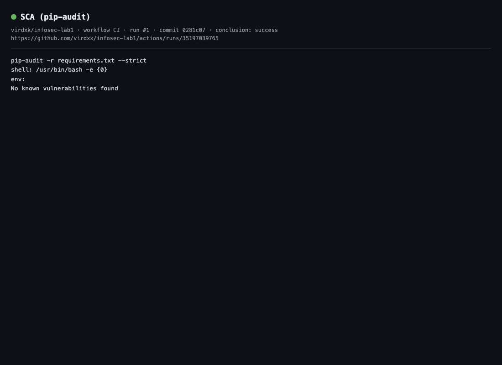

# Лабораторная работа № 1: защищённый REST API

Дисциплина: «Информационная безопасность», Университет ИТМО.
Автор: Елисеев Константин Иванович, группа P3308.

Приложение выдаёт JWT после проверки логина и пароля, позволяет читать и создавать посты. Стек: Python, Flask, SQLite, SQLAlchemy, PyJWT и bcrypt. Python выбран как знакомый язык; Flask позволяет явно показать маршруты, middleware и меры защиты в небольшом приложении.

[Репозиторий](https://github.com/virdxk/infosec-lab1) · [GitHub Actions](https://github.com/virdxk/infosec-lab1/actions/workflows/ci.yml) · [Протокол curl](docs/curl-session.md)

## Запуск

Нужен Python 3.12 или новее. Команды рассчитаны на macOS/Linux.

```bash
git clone git@github.com:virdxk/infosec-lab1.git
cd infosec-lab1
python3 -m venv .venv
source .venv/bin/activate
python -m pip install -r requirements-dev.txt
cp .env.example .env
python -c 'import secrets; print(secrets.token_urlsafe(48))'
```

Запишите сгенерированное значение после `JWT_SECRET=` в `.env`. Файл `.env` исключён из Git. Затем:

```bash
python seed.py
python wsgi.py
```

Сервер доступен по `http://127.0.0.1:5000`. Данные хранятся в `app.db` в текущем каталоге. Повторный запуск `seed.py` не дублирует демонстрационные записи.

| Настройка | Значение по умолчанию | Назначение |
|---|---|---|
| `JWT_SECRET` | Не задано | Секрет HS256, не менее 32 байт; генерируется случайно |
| `JWT_TTL_SECONDS` | `3600` | Срок действия токена в секундах |
| `DATABASE_URL` | `sqlite:///app.db` | Подключение к БД |
| `BCRYPT_ROUNDS` | `12` | Стоимость хэширования паролей |
| `PORT` | `5000` | Порт локального сервера |

Демонстрационные учётные записи: `alice` / `Al1ce-Str0ng-Pass!` и `admin` / `Adm1n-Str0ng-Pass!`. Это учебные данные из `seed.py`. В БД сохраняются только bcrypt-хэши. Различий в правах между этими пользователями нет.

## API и примеры вызова

| Метод | Назначение | JWT | Успех |
|---|---|---|---|
| `POST /auth/login` | Вход по логину и паролю | Не нужен | `200` |
| `GET /api/data` | Список постов | Обязателен | `200` |
| `POST /api/posts` | Создание поста | Обязателен | `201` |
| `GET /health` | Проверка доступности сервера | Не нужен | `200` |

### Вход

```bash
BASE_URL=http://127.0.0.1:5000
TOKEN=$(curl -fsS "$BASE_URL/auth/login" \
  -H 'Content-Type: application/json' \
  --data '{"username":"alice","password":"Al1ce-Str0ng-Pass!"}' \
  | python -c 'import json,sys; print(json.load(sys.stdin)["access_token"])')
```

Успешный ответ содержит `access_token`, `token_type: "Bearer"` и `expires_in: 3600`. Токен передаётся заголовком `Authorization: Bearer <token>`.

### Чтение и создание поста

```bash
curl -i "$BASE_URL/api/data" -H "Authorization: Bearer $TOKEN"

curl -i "$BASE_URL/api/posts" \
  -H "Authorization: Bearer $TOKEN" \
  -H 'Content-Type: application/json' \
  --data '{"title":"Учебный пост","body":"Пример текста"}'
```

Чтение возвращает объект с `count` и массивом `items`. Создание возвращает пост с полями `id`, `title`, `body`, `author`, `created_at`. Автор определяется по проверенному JWT, прислать чужой ID автора нельзя.

### Проверка отказа и экранирования

```bash
curl -i "$BASE_URL/api/data"

curl -i "$BASE_URL/api/posts" \
  -H "Authorization: Bearer $TOKEN" \
  -H 'Content-Type: application/json' \
  --data '{"title":"XSS probe","body":"<script>alert(1)</script>"}'
```

Первый запрос получает `401`. Второй получает `201`, а `body` содержит `&lt;script&gt;alert(1)&lt;/script&gt;`. При повторном чтении пост также возвращается экранированным.

Ошибки: `400` для неверного формата или отсутствующих строковых полей; `401` для неверного пароля, отсутствующего, поддельного или просроченного JWT; `404` для неизвестного адреса; `405` для неподдерживаемого метода. Произвольных лимитов длины логина и постов нет. Пароль длиннее 72 байт получает обычный отказ во входе из-за технического ограничения bcrypt.

## Реализованные меры защиты

### SQL Injection

В `app/auth.py` поиск выполняется через `select(User).where(User.username == username)`. SQLAlchemy передаёт имя связанным параметром. Строка `' OR '1'='1' --` остаётся значением имени пользователя и не меняет условие SQL. Конкатенации пользовательского ввода с SQL нет.

### XSS

`app/sanitize.py` экранирует `title`, `body` и имя автора через `markupsafe.escape`. Исходный текст сохраняется в БД; экранирование применяется при создании ответа и при чтении. `jsonify` задаёт JSON-формат ответа. Это выполняет требование ТЗ об экранировании возвращаемого пользовательского текста; будущий браузерный интерфейс также должен безопасно вставлять эти данные.

### Аутентификация и JWT

`app/auth.py` проверяет пароль через `bcrypt.checkpw` и выдаёт токен только при совпадении. Соль генерируется отдельно для каждого пароля и хранится внутри bcrypt-хэша вместе с параметрами алгоритма.

`app/security.py` выпускает токен HS256 с `sub`, `username`, `role`, `iat`, `exp`. Подпись защищает данные от изменения, но не шифрует их. Алгоритм проверки фиксирован сервером; `sub`, `iat`, `exp` обязательны.

В начале `app/api.py` зарегистрирован `api_bp.before_request(authenticate_request)`. Этот hook вызывает функцию из `app/middleware.py` перед защищёнными обработчиками. Middleware проверяет заголовок, подпись, срок и существование пользователя в БД. После успеха ID пользователя записывается в `g`, затем Flask вызывает обработчик. При ошибке возвращается `401`. Публичные `/auth/login` и `/health` не входят в этот blueprint; автоматический `OPTIONS` сообщает разрешённые методы без выдачи данных.

Все вошедшие пользователи читают общие посты. Поле `role` не реализует ролевые ограничения. В учебной работе нет MFA, ограничения попыток входа и отзыва отдельных JWT. Одинаковые сообщения при неверном пароле и неизвестном пользователе не устраняют различия во времени ответа.

## Автоматические проверки

```bash
pytest -q
bandit -r app seed.py wsgi.py -ll
pip-audit -r requirements.txt --strict
```

`.github/workflows/ci.yml` запускается при push и pull request. Три независимые задачи:

1. `test`: установка зависимостей и pytest.
2. `sast`: Bandit; замечания уровня medium/high завершают проверку ошибкой, полный JSON-отчёт сохраняется как `bandit-report`.
3. `sca`: OWASP Dependency-Check 13.0.0 и дополнительный pip-audit; HTML/JSON-отчёты сохраняются как `sca-reports` даже при неудаче проверки.

Dependency-Check анализирует отдельный `requirements.txt` со всеми установленными прикладными зависимостями, включая транзитивные. Для Python включён `--enableExperimental`. Порог отказа `--failOnCVSS 7` соответствует высоким и критическим уязвимостям. База загружается из официальных JSON 2.0 feeds NVD и кэшируется; аккаунт Snyk и NVD API key не требуются. Дополнительный pip-audit проверяет Python-пакеты по специализированной базе и завершает задачу ошибкой при любой найденной известной уязвимости.

Для этого Python-проекта отключены RetireJS (JavaScript), OSS Index (отдельный сервис с учётными данными), автоматическая загрузка исключений и проверка новой версии сканера. NVD-анализ включён; собственные исключения уязвимостей не добавлены. Ошибка скачивания или сканирования не превращается в успешную проверку.

При проверке 30.09.2026 аудит обнаружил известные уязвимости PyJWT 2.13.0. Версия обновлена до 2.14.0; повторный pip-audit не обнаружил известных уязвимостей. Тесты входа, подписи JWT и контроля доступа после обновления проходят.

## Результаты и материалы

Локальная проверка 30.09.2026: 51 тест пройден до обновления зависимости, 38 затронутых тестов повторно пройдены после обновления; Bandit без замечаний; Dependency-Check проверил 12 зависимостей без найденных уязвимостей; pip-audit также без найденных уязвимостей.

- [Фактические запросы и ответы curl](docs/curl-session.md): 11 сценариев, отдельная временная БД.
- [Локальный отчёт Bandit](docs/reports/bandit.json).
- [Локальный отчёт pip-audit](docs/reports/pip-audit.json).
- [Отчёт OWASP Dependency-Check](docs/reports/dependency-check-report.html).

Новый запуск GitHub Actions для окончательного набора изменений ещё не подтверждён. Перед сдачей нужна ссылка на его успешный результат и скриншоты его SAST/SCA-задач. Существующие изображения ниже относятся к прежней версии pipeline с pip-audit и не подтверждают новый Dependency-Check.




## Навигация по коду

| Файл | Ответственность |
|---|---|
| `app/__init__.py` | Создание приложения, конфигурация, подключение blueprints |
| `app/auth.py` | Вход по логину и паролю |
| `app/middleware.py` | Проверка JWT перед защищёнными обработчиками |
| `app/security.py` | Выдача и проверка JWT |
| `app/api.py` | Чтение и создание постов |
| `app/models.py` | Модели User/Post, bcrypt, подключение к БД |
| `app/sanitize.py` | Экранирование данных ответа |
| `seed.py` | Демонстрационные записи |

## Источники

- [Отчёт по лабораторной № 1](docs/report.pdf); оригинал задания преподавателя предоставлен отдельно.
- [Flask](https://flask.palletsprojects.com/en/stable/).
- [OWASP SQL Injection Prevention](https://cheatsheetseries.owasp.org/cheatsheets/SQL_Injection_Prevention_Cheat_Sheet.html).
- [OWASP Cross Site Scripting Prevention](https://cheatsheetseries.owasp.org/cheatsheets/Cross_Site_Scripting_Prevention_Cheat_Sheet.html).
- [OWASP Password Storage](https://cheatsheetseries.owasp.org/cheatsheets/Password_Storage_Cheat_Sheet.html).
- [JWT](https://www.jwt.io/introduction).
- [Dependency-Check: Pip Analyzer](https://dependency-check.github.io/DependencyCheck/analyzers/pip.html).
