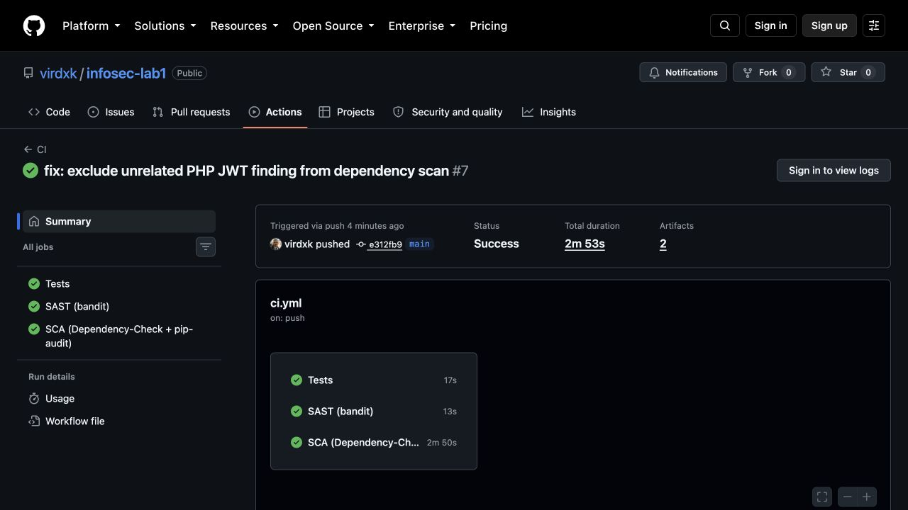
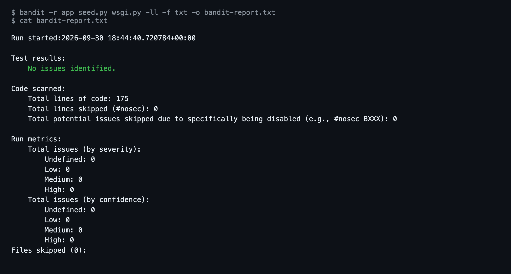
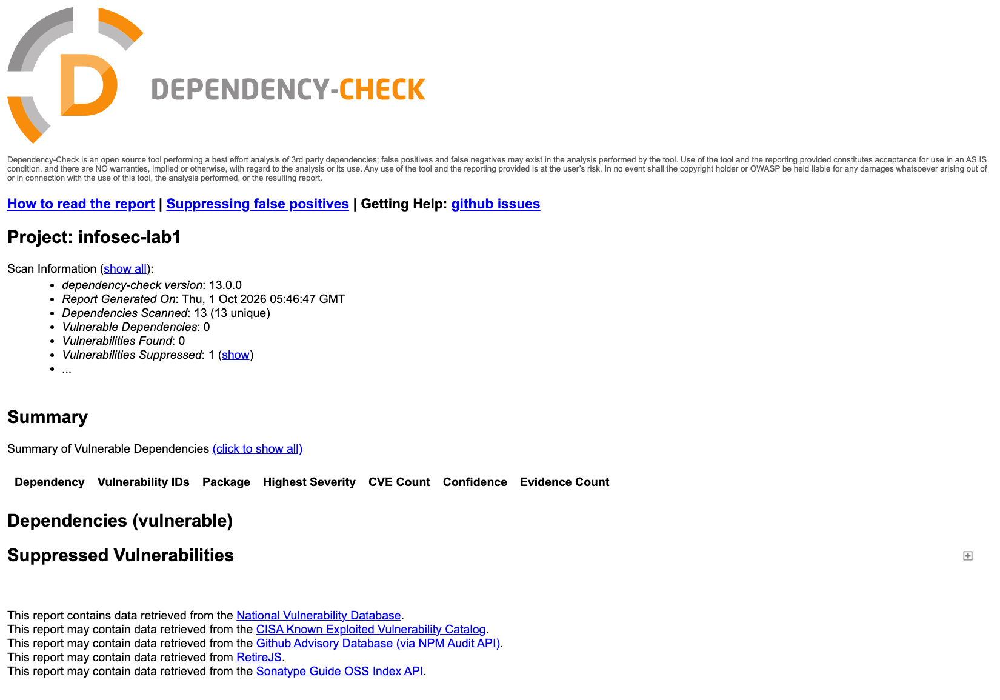

# Лабораторная работа № 1: защищённый REST API

Дисциплина «Информационная безопасность», Университет ИТМО. Елисеев Константин Иванович, группа P3408.

Небольшой REST API на Python: вход по логину и паролю с выдачей JWT, чтение и создание постов. Стек: Flask, SQLite через SQLAlchemy, PyJWT, bcrypt.

## Запуск

```bash
python3 -m venv .venv
source .venv/bin/activate
pip install -r requirements-dev.txt
cp .env.example .env   # вписать JWT_SECRET, сгенерировать командой из файла
python seed.py         # пользователи alice и bob, два поста
python wsgi.py         # http://127.0.0.1:5000
```

Демо-пароли: `alice` / `Al1ce-Str0ng-Pass!`, `bob` / `B0b-Str0ng-Pass!`.

## API

| Метод | Описание | Токен | Ответ |
|---|---|---|---|
| `POST /auth/login` | Вход, тело `{"username", "password"}` | не нужен | `200 {"access_token": ...}` |
| `GET /api/data` | Список постов | нужен | `200 [ {id, title, body, author}, ... ]` |
| `POST /api/posts` | Создать пост, тело `{"title", "body"}` | нужен | `201 {id, title, body, author}` |

Токен передаётся заголовком `Authorization: Bearer <token>`. Ошибки: `400` при неполном теле запроса, `401` при неверном пароле или отсутствующем, поддельном либо просроченном токене.

```bash
BASE_URL=http://127.0.0.1:5000
TOKEN=$(curl -s -X POST "$BASE_URL/auth/login" \
  -H 'Content-Type: application/json' \
  -d '{"username": "alice", "password": "Al1ce-Str0ng-Pass!"}' \
  | python3 -c 'import json, sys; print(json.load(sys.stdin)["access_token"])')

curl -s "$BASE_URL/api/data" -H "Authorization: Bearer $TOKEN"

curl -s -X POST "$BASE_URL/api/posts" \
  -H "Authorization: Bearer $TOKEN" \
  -H 'Content-Type: application/json' \
  -d '{"title": "Hello", "body": "World"}'
```

Все проверенные запросы с реальными ответами: [docs/curl-session.md](docs/curl-session.md).

## Меры защиты

### SQL-инъекции

Запросы к БД строятся через ORM SQLAlchemy, например `select(User).where(User.username == username)` в [app/auth.py](app/auth.py). Значение передаётся в SQL связанным параметром, поэтому ввод `' OR 1=1 --` остаётся обычной строкой логина. SQL из строк нигде не склеивается.

### XSS

Перед отдачей клиенту `title`, `body` и имя автора экранируются функцией `markupsafe.escape` ([app/sanitize.py](app/sanitize.py)): `<script>` превращается в `&lt;script&gt;`. В базе хранится исходный текст, экранирование применяется к каждому ответу.

### Аутентификация

- **Пароли.** Хранятся только bcrypt-хэши со случайной солью ([app/models.py](app/models.py)). Пароль проверяется через `bcrypt.checkpw`.
- **JWT.** После успешного входа выдаётся токен HS256 с полями `sub` (ID пользователя), `iat` и `exp` (срок 1 час) ([app/security.py](app/security.py)). При проверке алгоритм задан сервером, поэтому токены с `alg: none` отклоняются. Секрет берётся из `.env`, короче 32 символов приложение не запустится.
- **Middleware.** [app/middleware.py](app/middleware.py) подключено ко всем маршрутам `/api/*` через `before_request`. Оно проверяет заголовок, подпись и срок токена, находит пользователя в БД и только тогда пропускает запрос. Иначе ответ `401`. Автор нового поста берётся из токена, а не из тела запроса.
- **Ошибки входа.** На неверный пароль и на несуществующего пользователя ответ одинаковый, `invalid credentials`.

## CI/CD

[.github/workflows/ci.yml](.github/workflows/ci.yml) запускается на каждый push и pull request. Три задачи:

1. **Tests.** pytest, 14 тестов: вход, SQL-инъекция, хэш пароля, доступ без токена, поддельный, `alg: none` и просроченный токены, создание поста, XSS.
2. **SAST.** Bandit проверяет код приложения и падает на замечаниях уровня medium и выше. Отчёт сохраняется артефактом `bandit-report`.
3. **SCA.** OWASP Dependency-Check проверяет все зависимости, включая транзитивные, и падает при уязвимости с CVSS 7 и выше. HTML-отчёт сохраняется артефактом `dependency-check-report`. База уязвимостей NVD кэшируется между запусками, поэтому повторный скан занимает секунды.

В [.github/dependency-check-suppressions.xml](.github/dependency-check-suppressions.xml) исключено одно ложное срабатывание: CVE-2025-45770 относится к PHP-библиотеке `lcobucci/jwt`, а сканер сопоставил его с Python-пакетом PyJWT.

## Результаты

Проверенный запуск: [CI #12, коммит 1fd3837](https://github.com/virdxk/infosec-lab1/actions/runs/36821398841).

- Tests: 14 тестов пройдено.
- Bandit: 0 замечаний.
- OWASP Dependency-Check: 13 зависимостей, 0 уязвимостей, одно ложное срабатывание исключено.







Отчёты из артефактов: [bandit-report.txt](docs/reports/bandit-report.txt), [dependency-check-report.html](docs/reports/dependency-check-report.html). Отчёт по работе: [docs/report.pdf](docs/report.pdf).
